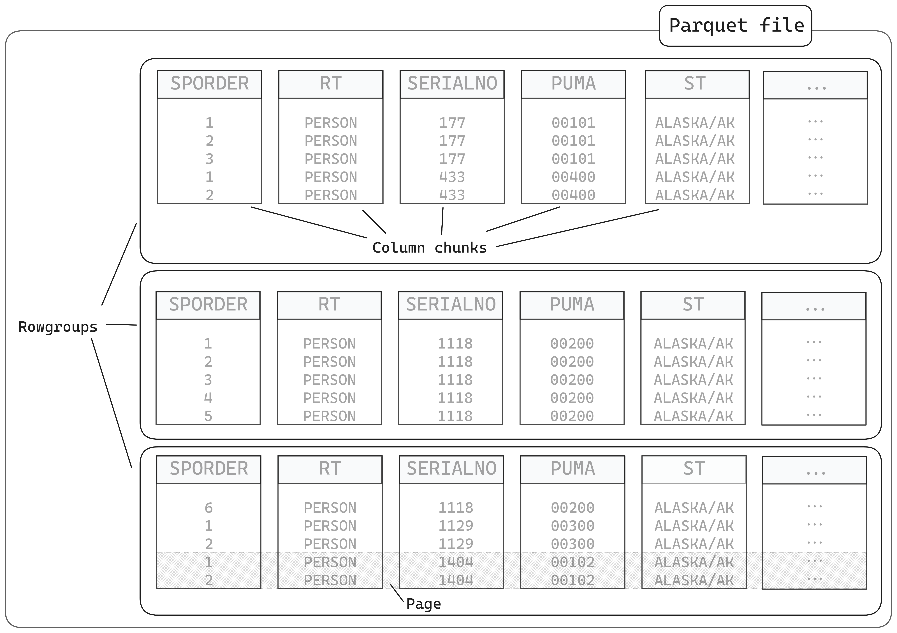

# Posit DS Lab - Parquet

## What is Parquet and why should you care?

- Smaller than equivalent CSV (uses encoding and compression)
- Contain information about data types of the columns 
- Column-oriented - better performance for data anlaysis tasks
- Chunked - fast to work with as can operate over parts in parallel

We'll look at these more closely later!

## What packages do I need to work with Parquet files?

Pick one of...

- [arrow](https://arrow.apache.org/docs/r/) - for all features, including working with multi-file datasets
- [nanoparquet](https://r-lib.github.io/nanoparquet/) - for a no-dependency package which has most (but not all) features
- [duckdb](https://r-duckdb.org/) - for SQL-oriented workflows

Today we'll focus on {arrow} but some examples with {nanoparquet}

## How does Parquet actually work?

How do you open a Parquet file? You can use `read_parquet()` from {arrow}

```{r}
library(arrow)

taxi <- read_parquet(
  "https://arrow-datasets.s3.amazonaws.com/nyc-taxi-tiny/year=2019/month=1/part-0.parquet"
)
# Below is the same file but locally
taxi <- read_parquet("taxi-mini.parquet")

# it's read in as a tibble automatically
class(taxi)

taxi
```

### Size/speed compared to CSVs

### Data types in Parquet files

### Why do types matter?

#### 1. Ordered factors

The diamonds dataset from ggplot2 has `cut` as an ordered factor. Easy to plot `cut` in order when we load the dataset directly from the ggplot2 package data.

```{r}
library(ggplot2)
ggplot(diamonds, aes(x = cut)) + geom_bar() + theme_minimal()
```

But in real life we do a lot more loading of data from files, so what happens if we save the data to a CSV and load it back in before plotting it?

```{r}
library(readr)

write_csv(diamonds, "diamonds.csv")
diamonds_from_csv <- read_csv("diamonds.csv")

ggplot(diamonds_from_csv, aes(x = cut)) + geom_bar() + theme_minimal()
```

CSV files don't have any concept of ordered factors - data is just saved as strings and so we'd need to tell R that `cut` is an ordered factor before plotting it to get it right.  But, Parquet saves data types and so we can write the data to Parquet and back to R and it keep track of the fact it's an ordered factor.

```{r}
library(arrow)

write_parquet(diamonds, "diamonds.parquet")
diamonds_from_parquet <- read_parquet("diamonds.parquet")

ggplot(diamonds_from_parquet, aes(x = cut)) + geom_bar() + theme_minimal()
```


### How do R types map to Arrow types (and vice versa)

These docs, written by Danielle Navarro have excellent information about translation between types:

https://arrow.apache.org/docs/r/articles/data_types.html#list-of-default-translations

### Column-oriented

If we think about how data is stored in memory, it's in a one-dimension structure - one value after another.

When we are doing analytics, we're typically asking questions like, "what's the mean value of this column", or "show me only values greater than X", and so we're thinking about things in terms of taking data from a column and doing something with it.

If data is stored in a *row-oriented* format, we need to skip between different places to retrieve values for a column, but if data is stored in a column-oriented format, we can just pull retrieve the chunk where our data is stored, which is more efficient.


### Parquet file chunking

A Parquet file is divided into smaller components.

- rowgroups, which contain...
- column chunks, which contain...
- pages

They also contain metadata





## Reading Parquet metadata

```{r}
nanoparquet::read_parquet_info("taxi-mini.parquet")
```

```{r}
nanoparquet::read_parquet_schema("taxi-mini.parquet")
```

```{r}
nanoparquet:::read_parquet_pages("taxi-mini.parquet")
```


## Arrow vs. Parquet vs. Feather

## Bonus: demo of analysis

## Where can I read more?


library(arrow)
library(dplyr)
library(tictoc)

# ============================================================================
# PART 1: What is Parquet and why should you care?
# ============================================================================

# Parquet is a binary, columnar file format designed for analytics.
# Key advantages over CSV:
#   - Typed: preserves data types (dates stay dates, not strings)
#   - Smaller on disk: efficient encoding and compression
#   - Faster to read and write
#   - Column-oriented: can read just the columns you need
#
# ============================================================================
# PART 2: Reading a Parquet file
# ============================================================================

# It's as easy as read_csv(). Let's grab a NYC taxi trip dataset
# straight from a URL:


# ============================================================================
# PART 3: CSV vs Parquet
# ============================================================================

# Let's make the comparison concrete. Save our taxi data as both formats:

write_csv_arrow(taxi, "taxi.csv")

# --- 3a. File size ---
fs::file_size("taxi.csv")   # CSV size in bytes
fs::file_size("taxi-mini.parquet")    # Parquet size in bytes

# Parquet is much smaller thanks to columnar encoding + compression.

# Notice: the CSV reader has to guess whether timestamps are timestamps,
# whether integers are integers vs doubles, etc. Parquet just knows.

# --- 3c. Speed ---

tmp_dir <- tempdir()

tic("Write CSV")
write_csv_arrow(taxi, file.path(tmp_dir, "taxi2.csv"))
toc()

tic("Write Parquet")
write_parquet(taxi, file.path(tmp_dir, "taxi2.parquet"))
toc()

tic("Read CSV")
read_csv_arrow("taxi.csv")
toc()

tic("Read Parquet")
read_parquet("taxi-mini.parquet")
toc()

# With bigger files, these differences become dramatic.
# On the full NYC taxi data (1.15 billion rows):
#   CSV:     ~1800 MB on disk, ~10s to query
#   Parquet: ~36 MB on disk, much faster


# ============================================================================
# PART 4: How Parquet works under the hood
# ============================================================================

# A Parquet file is organized internally like this:
#
#   File
#    +-- Row Group 1
#    |    +-- Column Chunk (col A)  ->  Pages
#    |    +-- Column Chunk (col B)  ->  Pages
#    |    +-- ...
#    +-- Row Group 2
#    |    +-- ...
#    +-- Footer (schema, row counts, min/max statistics per chunk)
#
# Fun fact: they're called "parquet" files - like parquet floor tiles!
# Each tile (column chunk) can be read independently.
#
# This structure enables:
#   - Reading only the columns you need (no wasted I/O)
#   - Skipping row groups based on statistics (e.g. min/max)
#   - Parallel reads across row groups
#
# Built-in optimizations:
#   - Dictionary encoding: repeated strings stored as key-value lookups
#   - Run-length encoding: "Married" x 5000 stored as ("Married", 5000)
#   - Compression: snappy (default) or zstd

# You can peek at the schema stored in the file:
taxi_table <- read_parquet(pq_path, as_data_frame = FALSE)
schema(taxi_table)

# Arrow Tables keep data in Arrow memory (not R memory).
# Call collect() to bring it into R as a tibble:
taxi_table |> collect()


# ============================================================================
# PART 5: Arrow vs Parquet vs Feather
# ============================================================================

# This is the distinction that confuses everyone:
#
#   Parquet = a FILE FORMAT for storing data on disk
#             (columnar, compressed, self-describing)
#
#   Arrow   = an IN-MEMORY FORMAT + set of tools for processing data
#             (the arrow R package gives you both)
#
#   Feather = an older name for the Arrow IPC format written to disk
#             (V1 is deprecated; V2 = Arrow IPC)
#
# In practice: you store data as Parquet files, and use Arrow to
# read/process them. Pick Parquet for storage unless you have a
# specific reason not to.


# ============================================================================
# PART 6: Saving and converting to Parquet
# ============================================================================

# The typical workflow: read CSV once, save as Parquet, use Parquet from now on.

# Single file conversion:
my_data <- read_csv_arrow(csv_path)
write_parquet(my_data, file.path(tmp_dir, "converted.parquet"))

# Round-trip: write to parquet and read back, types preserved
read_parquet(file.path(tmp_dir, "converted.parquet"))


# ============================================================================
# PART 7: Partitioning
# ============================================================================

# Partitioning = splitting a dataset into separate files based on column values.
# When you filter, Arrow only reads the relevant files.

# Let's partition our taxi data by payment_type:
write_dataset(
  taxi,
  path = file.path(tmp_dir, "taxi-partitioned"),
  format = "parquet",
  partitioning = "payment_type"
)

# This creates a directory structure:
list.files(file.path(tmp_dir, "taxi-partitioned"), recursive = TRUE)

# Read the partitioned dataset back:
taxi_ds <- open_dataset(file.path(tmp_dir, "taxi-partitioned"))

# Filtering only reads the relevant partition files:
taxi_ds |>
  filter(payment_type == "Credit card") |>
  summarise(avg_tip = mean(tip_amount, na.rm = TRUE)) |>
  collect()

# Guidelines for partitioning:
#   - Partition on columns you frequently filter by
#   - Aim for individual files between 20 MB and 2 GB
#   - Avoid more than ~10,000 partition files


# ============================================================================
# PART 8: What you can and can't store in Parquet
# ============================================================================

# CAN store:
#   - All standard R types (numeric, integer, character, logical, Date, POSIXct)
#   - List columns (nested data)
#   - Factor levels
#   - Custom R classes (preserved via metadata when round-tripping in R)

# Nested data example - list columns survive the round-trip:
nested_data <- tibble(
  species = c("cat", "dog", "bird"),
  sounds  = list(
    c("meow", "purr", "hiss"),
    c("woof", "bark", "growl"),
    c("tweet", "squawk")
  )
)

write_parquet(nested_data, file.path(tmp_dir, "nested.parquet"))
read_parquet(file.path(tmp_dir, "nested.parquet"))

# CAN'T store:
#   - Arbitrary R objects (ggplot objects, model fits, environments)
#   - Everything must map to Parquet's type system
#   - Custom R class metadata is R-specific (won't auto-translate to Python)
-->